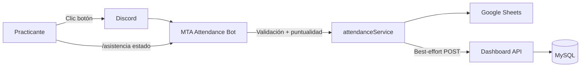

# MTA Attendance Bot

Bot de Discord para el control de asistencia de practicantes. Resuelve un problema real de operación: registrar entrada/salida sin permitir texto libre en el canal, persistir los datos y sincronizarlos con un dashboard interno.

[](https://www.typescriptlang.org/)
[](https://discord.js.org/)
[](https://nodejs.org/)
[](LICENSE)

---

## Problema

En un canal de asistencia con **“Enviar mensajes” desactivado** (para evitar chat libre), los practicantes no pueden usar slash commands. Hacía falta un flujo usable, auditable y conectado a un sistema centralizado.

## Solución

Un bot que publica un **panel fijo con botones** (funcionan sin permiso de escribir texto), valida reglas de negocio (ventana horaria y puntualidad), responde de forma **efímera** al usuario y guarda el registro en:

1. **Google Sheets** — respaldo operativo  
2. **API REST del dashboard** — fuente para supervisión y reportes  

---

## Capturas

> Sustituye los placeholders colocando imágenes en [`docs/screenshots/`](docs/screenshots/README.md).

| Panel de botones | Confirmación de entrada |
|:---:|:---:|
|  |  |

| Confirmación de salida | Consulta `/asistencia estado` |
|:---:|:---:|
|  |  |

| Dashboard | Google Sheets (opcional) |
|:---:|:---:|
|  |  |

---

## Funcionalidades

- Panel persistente con botones **Marcar Entrada** / **Marcar Salida** (sin duplicar mensaje al reiniciar; se fija en el canal)
- Validación de ventana de entrada y cálculo de **Puntual / Tardanza**
- Respuestas efímeras al practicante (`deferReply` para operaciones lentas)
- Persistencia en **Google Sheets**
- Sync best-effort al **dashboard** (`POST` + `x-api-key`; si falla el API, no bloquea al usuario)
- Consulta del día con `/asistencia estado`
- Configuración de horarios centralizada en un solo archivo

### Reglas de negocio (configurables)

| Regla | Valor por defecto | Archivo |
|-------|-------------------|---------|
| Ventana de entrada | 07:00 – 23:00 | `src/config/business.ts` |
| Límite de puntualidad | 07:30 | idem |
| Zona horaria | `TIMEZONE` en `.env` (ej. `America/Lima`) | `.env` |

---

## Stack

| Capa | Tecnología |
|------|------------|
| Runtime | Node.js 18+, TypeScript |
| Discord | discord.js v14 (botones, embeds, slash) |
| Persistencia | Google Sheets API (`googleapis`) |
| Integración | `fetch` nativo → API REST interna |
| Config | dotenv |

---

## Arquitectura



Separación por capas: `handlers` (Discord) → `services` (negocio + integraciones) → `config` / `embeds` / `utils`.

---

## Estructura del proyecto

```
src/
├── commands/           # Slash: /asistencia estado
├── components/         # ActionRow + botones del panel
├── config/             # Env, Discord, Google, dashboard, reglas de negocio
├── embeds/             # Respuestas visuales
├── events/             # ready: init Sheets + panel fijo
├── handlers/           # commandHandler + buttonHandler
├── interfaces/         # Modelos de asistencia
├── services/
│   ├── attendanceService.ts   # Lógica de negocio
│   ├── sheetsService.ts       # Google Sheets
│   └── dashboardService.ts    # HTTP al backend
├── types/
├── utils/
├── deploy-commands.ts
└── index.ts
```

---

## Puesta en marcha

### Requisitos

- Node.js 18+
- Bot en el [Discord Developer Portal](https://discord.com/developers/applications)
- Google Cloud con **Sheets API** + cuenta de servicio
- (Opcional) Backend con endpoints `/api/attendance/entrada` y `/salida`

### 1. Clonar e instalar

```bash
git clone https://github.com/Hernandz09/mta-attendance-bot.git
cd mta-attendance-bot
npm install
cp .env.example .env
```

### 2. Variables de entorno

Completa `.env` (ver `.env.example`). Resumen:

| Variable | Uso |
|----------|-----|
| `DISCORD_TOKEN` / `DISCORD_CLIENT_ID` | Autenticación del bot |
| `ATTENDANCE_CHANNEL_ID` | Canal del panel de botones |
| `DISCORD_GUILD_ID` | Registro rápido de comandos (dev) |
| `GOOGLE_*` | Acceso a la hoja de cálculo |
| `DASHBOARD_API_URL` / `ATTENDANCE_BOT_API_KEY` | Sync opcional al dashboard |
| `TIMEZONE` | Zona horaria de negocio |

> Nunca subas el `.env` ni claves privadas. `.gitignore` ya excluye secretos.

### 3. Discord

1. Crea la aplicación y el bot; copia token y Application ID.  
2. Invita con scopes `bot` + `applications.commands`.  
3. En `#asistencias`, el bot necesita ver canal, enviar mensajes, leer historial y (recomendado) fijar mensajes.  
4. Los practicantes pueden tener **Enviar mensajes** desactivado: los botones siguen funcionando.

### 4. Google Sheets

1. Comparte la hoja con el email de la cuenta de servicio (Editor).  
2. El bot crea/usa la pestaña `Asistencias` con columnas:  
   `discord_id | username | fecha | hora_entrada | hora_salida | estado`

### 5. Ejecutar

```bash
npm run deploy-commands   # registrar /asistencia estado
npm run dev               # desarrollo
# o
npm run build && npm start
```

---

## Scripts

| Script | Descripción |
|--------|-------------|
| `npm run dev` | Desarrollo con recarga (`tsx watch`) |
| `npm run build` | Compila a `dist/` |
| `npm start` | Ejecuta el build |
| `npm run deploy-commands` | Publica slash commands |

---

## Decisiones de diseño (destacables en CV)

- **Botones vs slash** en canales restringidos (UX alineada a permisos de Discord).  
- **Sheets primero, dashboard después** — consistencia si el API cae; sync “best effort”.  
- **`deferReply`** ante I/O lento (evita `Unknown interaction` / 10062).  
- **Reglas de negocio desacopladas** del transporte Discord.  
- Panel **idempotente** al reiniciar (busca mensaje existente / pin).

---

## Roadmap

Ideas siguientes (fuera del MVP actual):

- [ ] Justificación de tardanzas/ausencias hacia canal de supervisión  
- [ ] Reporte semanal automático (cron)  
- [ ] Cierre automático de salidas no marcadas al final del día  

---

## Solución de problemas

**`Unknown interaction` (10062)**  
Ya mitigado con `deferReply` en los botones. Si aparece, confirma que no hay otra instancia del bot respondiendo la misma interacción.

**Los botones no aparecen**  
Revisa `ATTENDANCE_CHANNEL_ID` y permisos del bot en ese canal.

**Falla solo el dashboard**  
El usuario igual ve éxito (Sheets OK). Revisa logs: `Error al sincronizar ... con el dashboard`.

**Comandos slash no aparecen**  
`npm run deploy-commands`. Sin `DISCORD_GUILD_ID`, el deploy global puede tardar ~1 h.

---

## Licencia

[MIT](LICENSE) — Copyright © 2026 MTA

---

Hecho como MVP de integración Discord + TypeScript + APIs externas, orientado a un flujo real de operaciones.
